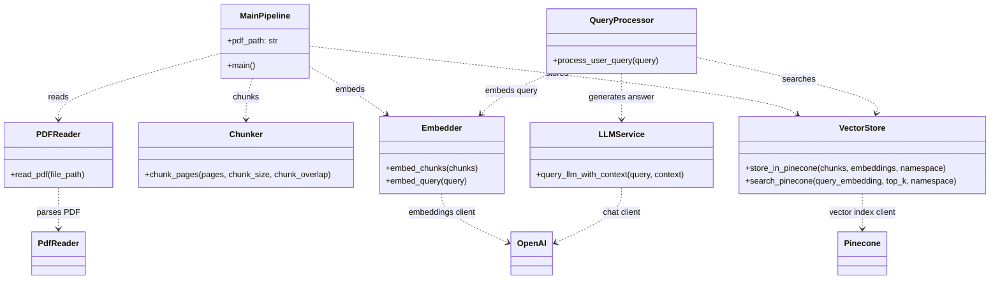

# UML Class Diagram

This project is organized as a small set of module-level services rather than traditional OOP classes. The diagram below models each module as a UML class facade so the relationships in the pipeline are easy to read.

PlantUML source: [uml-class-diagram.puml](uml-class-diagram.puml)
Rendered SVG: [uml-class-diagram.svg](uml-class-diagram.svg)

